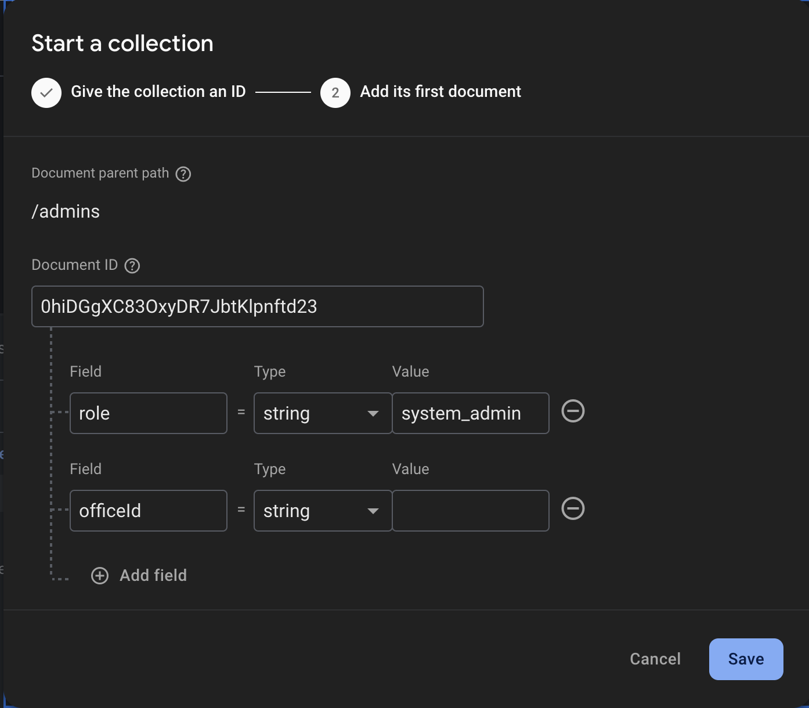

# How to Create a System Admin/First User

## Step-by-Step Instructions

1. **Log in** to the Firebase Console
2. **Navigate** to the `Authentication` module and create the system admin user
3. **Copy** the system admin user ID (format: `0hiDGgXC83OxyDR7JbtKlpnftd23`)
4. **Go to** the `Firestore Database` module
5. **Create** a collection named `admins` if it doesn't exist
6. **Add** a new document using the user's ID as the document ID
7. **Set document properties** for each required claim:

## Automated Processing

The Cloud Function will:
1. ⚡ **Apply** all claims to the user account
2. 🗑️ **Delete** the document when complete (typically within seconds)

## Verification & Troubleshooting

✅ **Success criteria:**
- Document disappears from Firestore

🔧 **If issues occur:**
1. Check Cloud Function logs
2. Verify:
   - Function is deployed
   - Correct Firebase project is selected
   - No errors in emulator (if testing locally)

> 💡 Pro Tip: Always create at least two admin accounts for redundancy.